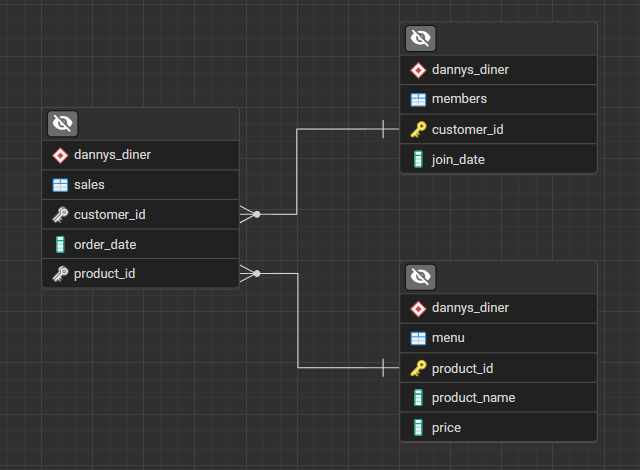

# 🍜 Danny's Diner Case Study

Hello and welcome! This project is an exciting dive into the world of restaurant analytics! Danny has shared 3 key datasets for his diner, and he needs our help to unlock the secrets behind his customers' visiting patterns, spending habits, and favorite menu items. 🚀

This repository showcases how SQL can be used to extract meaningful insights that help businesses like Danny's Diner deliver a better personalized experience for their loyal customers! ✨

## 📚 Problem Statement

Danny wants to use the data to answer **10 key questions** about his customers. He plans to use these insights to decide whether to expand the existing customer loyalty program. Additionally, he needs help generating some basic datasets so his team can easily inspect the data without needing SQL every time.

The data comes from 3 tables:

1.  **sales**: Customer order history (customer_id, order_date, product_id).
2.  **menu**: Product details (product_id, product_name, price).
3.  **members**: Loyalty program membership details (customer_id, join_date).

## 🗄️ Entity Relationship Diagram

The relationships between the `sales`, `menu`, and `members` tables are centered around `customer_id` and `product_id`.

-   **Sales** links to **Menu** via `product_id`.
-   **Sales** links to **Members** via `customer_id`.

This structure allows us to join tables and answer complex questions!

## 💡 Case Study Solutions

I have solved all 10 questions using SQL! From calculating total spend to identifying the most popular items, every query is documented and explained.

👉 **[Check out the full detailed analysis in `SOLUTIONS.md`](SOLUTIONS.md)** 👈

There, you will find clean SQL queries and explanations for each step of the analysis. It's a great resource to see the logic in action!

## 🚀 Looking Ahead

Great things are on the horizon! With these insights, Danny's Diner is well on its way to becoming a data-driven success story. The potential for growth is enormous, and analyzing this data is just the first step towards a bright future! �

---

**⭐ If you find this project interesting, please consider giving it a star! ⭐**

  <i>⚡ Crafted by Vijay Adithya B K</i>

